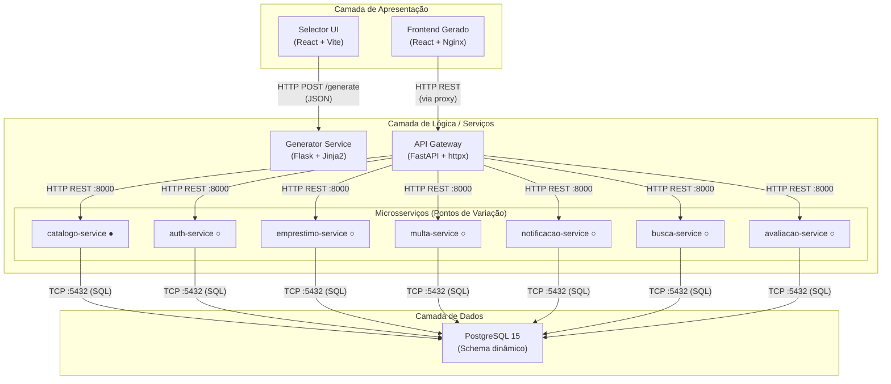
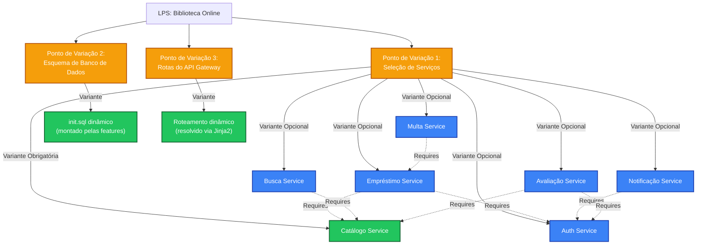
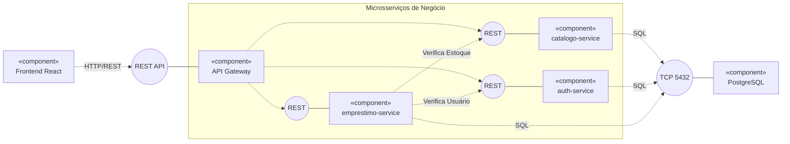
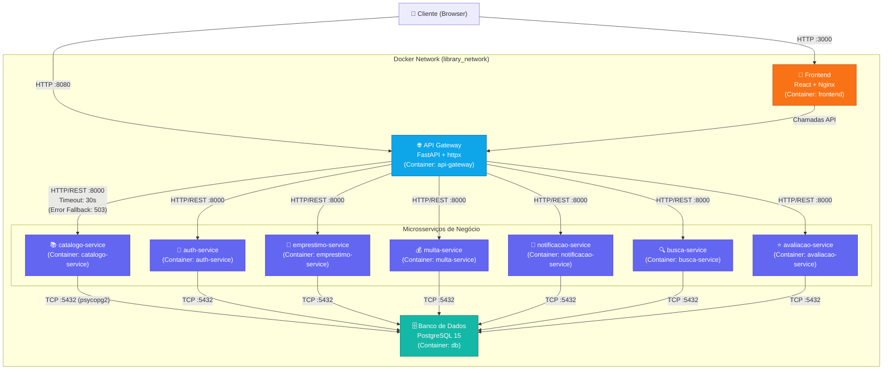
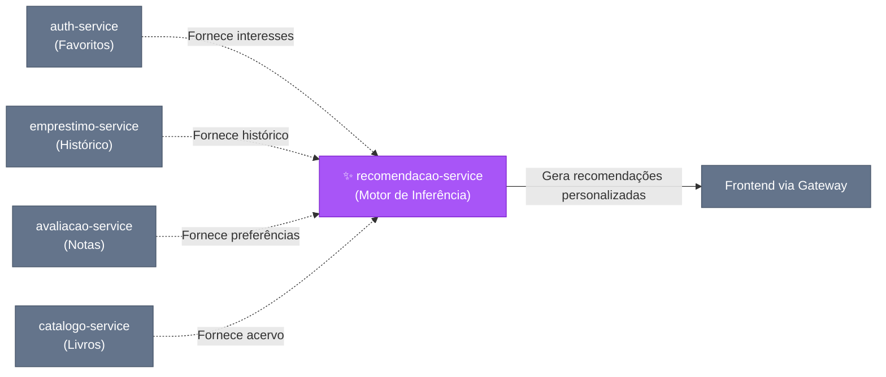
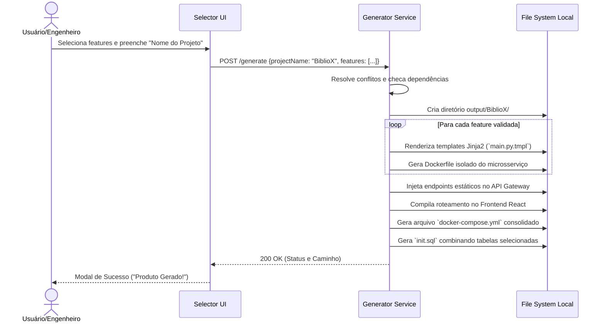
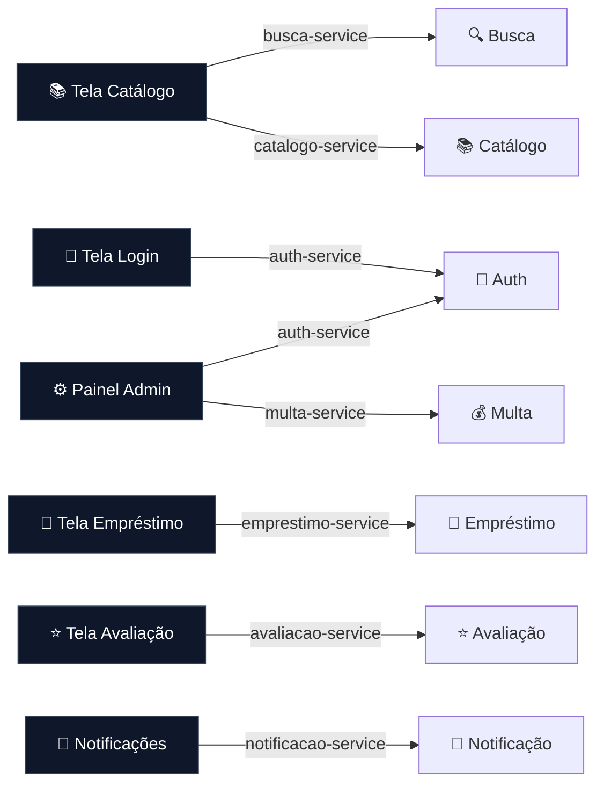
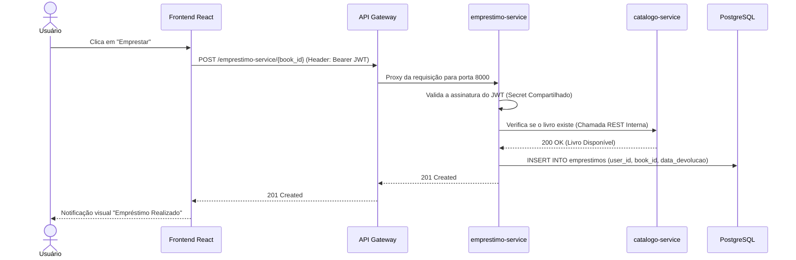
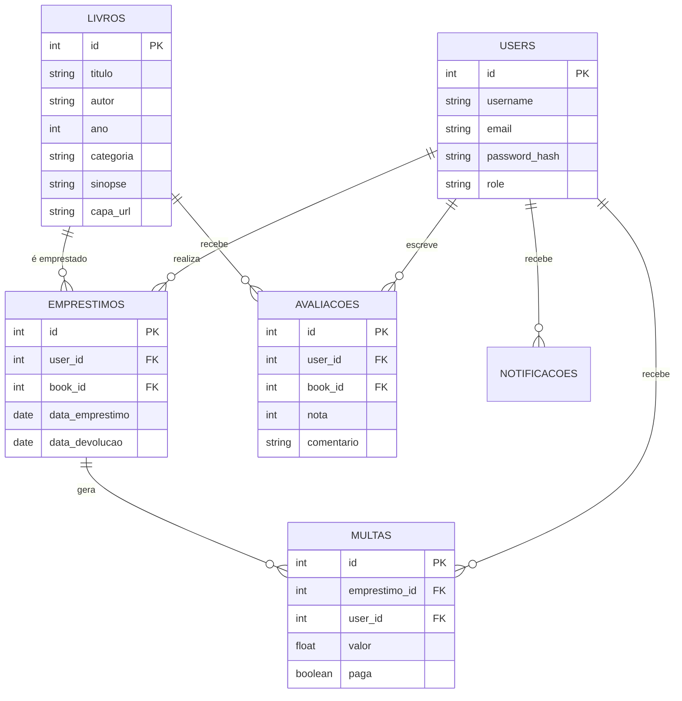

# Relatório do Projeto — Biblioteca LPS

**Disciplina:** Tópicos em Engenharia de Software  
**Tema:** *Projetando Linhas de Produto de Software*  
**Autor:** Hélio José  
**Professor:** Arturo Hernandez Dominguez  
**Instituição:** Instituto de Computação — UFAL  
**Período:** 6º período  

---

## 1. Enunciado do Projeto

### Parte 1 — Modelagem

O projeto consiste na concepção e implementação de uma **Linha de Produto de Software (LPS)** para o domínio de **Biblioteca Online**. A LPS permite a geração automática de aplicações backend customizadas, compostas por microsserviços selecionados pelo usuário por meio de uma interface gráfica (Selector UI). As aplicações geradas incluem API Gateway, frontend React, banco de dados PostgreSQL e orquestração via Docker Compose.

**Objetivo:** O objetivo principal é demonstrar a aplicação de técnicas de reuso de software (LPS, microsserviços e componentes) para criar um sistema flexível e escalável, capaz de gerar diferentes produtos (variantes) a partir de uma base comum, atendendo a necessidades específicas de diferentes bibliotecas.

**Requisitos Funcionais:**
- Interface web (Selector UI) interativa para seleção de features.
- Motor de geração (Generator Service) capaz de processar as escolhas e compor o sistema final.
- Resolução automática de dependências e exclusões entre features selecionadas.
- Geração de microsserviços de negócio (Catálogo, Autenticação, Empréstimo, Multas, Avaliação, Notificação e Busca).
- Geração de script SQL consolidado adaptado às features escolhidas.

**Requisitos Não Funcionais:**
- Arquitetura baseada em microsserviços com comunicação via API Gateway.
- Persistência de dados isolada para cada serviço no banco PostgreSQL.
- Uso de templates (Jinja2) como componentes de software reutilizáveis.
- Automação da infraestrutura via Docker e Docker Compose, entregando um produto pronto para execução.

---

## 2. Metodologia Ágil Escolhida

**Metodologia escolhida:** Scrum

**Período de desenvolvimento:** 15/05/2026 a 08/06/2026 (25 dias úteis, ~3,5 semanas)

### Papéis

| Papel                  | Responsável   |
|------------------------|---------------|
| Product Owner          | Hélio José    |
| Scrum Master           | Hélio José    |
| Time de Desenvolvimento| Hélio José    |

### Eventos

- **Sprints:** 4 sprints de duração variável (5–8 dias), adaptadas ao escopo restante.
- **Sprint Planning:** Realizada no primeiro dia de cada sprint, com definição das tarefas e metas.
- **Daily Stand-ups:** Auto-avaliação diária do progresso e bloqueios.
- **Sprint Review:** Avaliação do incremento ao final de cada sprint.
- **Sprint Retrospective:** Reflexão sobre o processo e ajustes para a sprint seguinte.

### Artefatos

- **Product Backlog:** Lista priorizada de todas as funcionalidades da LPS (ver seção 5).
- **Sprint Backlog:** Subconjunto do Product Backlog selecionado para cada sprint.
- **Incremento:** Software funcional entregue ao final de cada sprint.

### Ferramentas de Gestão

- **GitHub:** Controle de versão e hospedagem do código-fonte.
- **GitHub Issues:** Rastreamento de tarefas e bugs.

### Cronograma de Sprints

| Sprint | Período               | Duração  | Objetivo Principal                                         |
|:------:|:---------------------:|:--------:|------------------------------------------------------------|
| 1      | 15/05 – 22/05/2026    | 8 dias   | Planejamento, modelagem de features e setup da LPS          |
| 2      | 23/05 – 29/05/2026    | 7 dias   | Módulos core + auth + empréstimo + Selector UI              |
| 3      | 30/05 – 04/06/2026    | 6 dias   | Módulos opcionais (multa, notificação, busca, avaliação) + frontend gerado |
| 4      | 05/06 – 08/06/2026    | 4 dias   | Integração end-to-end, testes, documentação e polimento     |

---

## 3. Técnicas de Reuso de Software Utilizadas

**Técnicas utilizadas:** Linhas de Produto de Software, Microsserviços e Componentes de Software

O desenvolvimento deste projeto fundamentou-se na integração destas três técnicas para garantir modularidade e alta capacidade de customização.

### 3.1. Linhas de Produto de Software

A abordagem de LPS foi adotada dividindo o ciclo de vida em duas fases clássicas:
- **Engenharia de Domínio:** Focada na análise do domínio de "Biblioteca". Foram identificadas as funcionalidades comuns (núcleo) e variáveis, resultando no desenvolvimento dos artefatos reutilizáveis (templates) e na definição da arquitetura de referência. As variabilidades foram mapeadas e controladas no arquivo `features.js` (no Selector UI).
- **Engenharia de Aplicação:** Fase onde o **Generator Service** atua como uma "fábrica de software". Ele recebe a configuração do produto desejado (em JSON) e resolve as variabilidades, selecionando e compondo os artefatos para instanciar um produto único e executável.

### 3.2. Microsserviços

A arquitetura orientada a microsserviços foi o principal mecanismo arquitetural:
- **Isolamento de Funcionalidades:** Cada feature de negócio da LPS foi projetada como um serviço independente (ex: `catalogo-service`, `auth-service`), com ciclo de vida e base de código próprios, expondo endpoints REST isolados.
- **Desacoplamento de Dados:** Embora o banco PostgreSQL seja compartilhado na infraestrutura de containers, cada serviço acessa e controla apenas suas próprias tabelas (ex: `users` para auth, `livros` para catálogo), reduzindo o acoplamento.
- **Ponto Único de Entrada:** O `API Gateway` consolida as requisições, realizando proxy reverso de forma transparente para o cliente.

### 3.3. Componentes de Software

O desenvolvimento baseado em componentes complementa a implementação técnica:
- **Templates como Componentes Dinâmicos:** Os microsserviços são gerados a partir de templates `.tmpl` processados pela engine Python Jinja2. Isso permite injetar configurações e compor arquivos.
- **Artefatos de Infraestrutura:** Arquivos `Dockerfile` para Python e Nginx são generalizados e reaproveitados em vários módulos da aplicação gerada.
- **Composição de Schema:** O script de inicialização do banco de dados (`init.sql`) atua como um componente composto dinamicamente com base nas tabelas requeridas por cada microsserviço selecionado.

---

## 4. Desenvolvimento do Projeto

O desenvolvimento do projeto seguiu a metodologia Scrum com sprints curtas, combinando as técnicas de reuso de Linhas de Produto de Software, Microsserviços e Componentes de Software. Abaixo, o relato de cada sprint.

### Sprint 1 — Planejamento e Modelagem (15/05 – 22/05/2026)

- Definição do domínio (Biblioteca Online) e levantamento de requisitos.
- Modelagem do diagrama de features com análise de dependências entre módulos.
- Setup do repositório GitHub e estrutura inicial do projeto.
- Implementação do **Generator Service** (Flask + Jinja2) com endpoint `POST /generate`.
- Criação do template base do **catalogo-service** (feature core obrigatória).
- Definição da arquitetura em camadas e escolha das tecnologias (FastAPI, PostgreSQL, Docker).

**Decisões técnicas:** Escolha do FastAPI para os microsserviços gerados (performance + documentação automática). Adoção de Jinja2 para renderização condicional dos templates. PostgreSQL como banco relacional compartilhado com schema condicional.

### Sprint 2 — Módulos Essenciais e Interface de Seleção (23/05 – 29/05/2026)

- Implementação do **Selector UI** (React 19 + Vite 8) com sistema de seleção de features e resolução transitiva de dependências.
- Template completo do **auth-service** (JWT, bcrypt, coleções, favoritos, painel admin).
- Template completo do **emprestimo-service** (check-in/check-out, limites, auditoria).
- Template do **API Gateway** (FastAPI + httpx, proxy reverso com service discovery).
- Template do **docker-compose.yml** para orquestração do produto gerado.
- Schema SQL condicional (`init.sql.tmpl`) com tabelas condicionais por feature.

**Decisões técnicas:** Resolução transitiva de dependências na UI para garantir consistência. Service discovery baseado em nomes de containers Docker. API Gateway como ponto único de entrada com timeout de 30s.

### Sprint 3 — Módulos Opcionais e Frontend Gerado (30/05 – 04/06/2026)

- Template completo do **multa-service** (multas, quitação, resumo contábil).
- Template completo do **notificacao-service** (alertas, broadcast, badges).
- Template completo do **busca-service** (filtros avançados, estatísticas, destaques).
- Template completo do **avaliacao-service** (reviews, UPSERT, ranking top 10).
- Geração dinâmica do **frontend React** com features habilitadas.
- Eliminação dos stubs genéricos — todos os módulos passaram a ter templates dedicados.

**Decisões técnicas:** Migração de stubs genéricos para templates completos com regras de negócio reais. Frontend gerado com `features.js` dinâmico para habilitar/desabilitar seções da UI.

### Sprint 4 — Integração, Testes e Polimento (05/06 – 08/06/2026)

- Integração end-to-end de todos os módulos com Docker Compose.
- Testes de geração com diferentes combinações de features.
- Implementação da exportação em ZIP do produto gerado.
- Auto-scaffolding de `.env` e `README.md` contextualizado no produto.
- Documentação final (README.md, Docs/).
- Correção de bugs e ajustes de UI.

**Decisões técnicas:** Exportação ZIP para facilitar distribuição. README contextualizado gerado automaticamente com as features selecionadas.


---

## 5. Product Backlog e Sprint Backlog

### Product Backlog

| ID   | User Story                                                                  | Prioridade | Sprint | Status |
|:----:|-----------------------------------------------------------------------------|:----------:|:------:|:------:|
| PB01 | Como admin, quero gerenciar o acervo de livros (CRUD)                       | Alta       | 1      | ✅     |
| PB02 | Como usuário, quero buscar livros por título, autor e categoria             | Alta       | 3      | ✅     |
| PB03 | Como usuário, quero me registrar e fazer login no sistema                    | Alta       | 2      | ✅     |
| PB04 | Como usuário, quero emprestar e devolver livros                             | Alta       | 2      | ✅     |
| PB05 | Como admin, quero aplicar multas por atrasos e irregularidades              | Média      | 3      | ✅     |
| PB06 | Como admin, quero enviar notificações para usuários                         | Média      | 3      | ✅     |
| PB07 | Como usuário, quero avaliar livros com notas e resenhas                     | Média      | 3      | ✅     |
| PB08 | Como usuário, quero selecionar features e gerar um produto customizado      | Alta       | 2      | ✅     |
| PB09 | Como desenvolvedor, quero um API Gateway como ponto único de entrada        | Alta       | 2      | ✅     |
| PB10 | Como desenvolvedor, quero orquestração Docker Compose automática            | Alta       | 2      | ✅     |
| PB11 | Como usuário, quero criar coleções pessoais de livros                       | Baixa      | 2      | ✅     |
| PB12 | Como usuário, quero marcar livros como favoritos                            | Baixa      | 2      | ✅     |
| PB13 | Como desenvolvedor, quero exportar o produto gerado em ZIP                  | Média      | 4      | ✅     |
| PB14 | Como admin, quero ver estatísticas do acervo                                | Baixa      | 3      | ✅     |
| PB15 | Como admin, quero ver ranking dos livros mais bem avaliados                 | Baixa      | 3      | ✅     |

### Sprint Backlogs

#### Sprint 1 (15/05 – 22/05/2026)

| Tarefa                                      | Status |
|---------------------------------------------|:------:|
| Definição do domínio e requisitos           | ✅     |
| Modelagem do diagrama de features           | ✅     |
| Setup do repositório GitHub                 | ✅     |
| Implementação do Generator Service (Flask)  | ✅     |
| Template catalogo-service                   | ✅     |
| Definição da arquitetura e tecnologias      | ✅     |

#### Sprint 2 (23/05 – 29/05/2026)

| Tarefa                                         | Status |
|------------------------------------------------|:------:|
| Selector UI (React + Vite)                     | ✅     |
| Template auth-service (JWT, coleções, favoritos)| ✅     |
| Template emprestimo-service                    | ✅     |
| Template API Gateway                           | ✅     |
| Template docker-compose.yml                    | ✅     |
| Schema SQL condicional (init.sql)              | ✅     |

#### Sprint 3 (30/05 – 04/06/2026)

| Tarefa                                      | Status |
|---------------------------------------------|:------:|
| Template multa-service                      | ✅     |
| Template notificacao-service                | ✅     |
| Template busca-service                      | ✅     |
| Template avaliacao-service                  | ✅     |
| Frontend React gerado                       | ✅     |
| Eliminação de stubs genéricos               | ✅     |

#### Sprint 4 (05/06 – 08/06/2026)

| Tarefa                                      | Status |
|---------------------------------------------|:------:|
| Integração end-to-end                       | ✅     |
| Testes com diferentes combinações           | ✅     |
| Exportação ZIP                              | ✅     |
| Auto-scaffolding (.env, README)             | ✅     |
| Documentação final                          | ✅     |
| Correção de bugs                            | ✅     |


### 5.1. Diagrama de Features

<!-- TODO: Inserir o Diagrama de Features da LPS Biblioteca.
     Pode ser gerado como diagrama Mermaid ou imagem.
     Deve mostrar: features obrigatórias, opcionais e suas dependências. -->

```mermaid
%%{init: {'theme': 'base', 'themeVariables': {'primaryColor': '#6366f1'}}}%%
graph TD
    classDef root fill:#1e40af,stroke:#1e3a8a,stroke-width:2px,color:#fff;
    classDef mandatory fill:#16a34a,stroke:#14532d,stroke-width:2px,color:#fff;
    classDef optional fill:#f59e0b,stroke:#78350f,stroke-width:2px,color:#fff;

    LPS["🏛️ Biblioteca Online (Root)"]:::root

    LPS -->|Mandatory| CORE["📚 catalogo-service"]:::mandatory
    LPS -.->|Optional| AUTH["🔐 auth-service"]:::optional
    LPS -.->|Optional| BUSCA["🔍 busca-service"]:::optional

    AUTH -.->|Optional (Requires Auth)| EMP["🔄 emprestimo-service"]:::optional
    EMP -.->|Optional (Requires Empréstimo)| MULTA["💰 multa-service"]:::optional
    
    AUTH -.->|Optional (Requires Auth)| NOTIF["🔔 notificacao-service"]:::optional
    AUTH -.->|Optional (Requires Auth)| AVAL["⭐ avaliacao-service"]:::optional
```

**Tabela de Features e Dependências:**

| ID                     | Nome                       | Categoria     | Obrigatória | Dependências                          |
|------------------------|----------------------------|---------------|:-----------:|---------------------------------------|
| `catalogo-service`     | Serviço de Catálogo        | Core          | ✅           | —                                     |
| `auth-service`         | Serviço de Autenticação    | Segurança     | ❌           | —                                     |
| `emprestimo-service`   | Serviço de Empréstimo      | Operacional   | ❌           | `auth-service`, `catalogo-service`    |
| `multa-service`        | Serviço de Multas          | Financeiro    | ❌           | `emprestimo-service`                  |
| `notificacao-service`  | Serviço de Notificação     | Comunicação   | ❌           | `auth-service`                        |
| `busca-service`        | Serviço de Busca           | Exploração    | ❌           | `catalogo-service`                    |
| `avaliacao-service`    | Serviço de Avaliação       | Social        | ❌           | `auth-service`, `catalogo-service`    |

### 5.2. Arquitetura em Camadas e Diagrama de Variabilidade

<!-- TODO: Inserir diagrama de Arquitetura em Camadas (Apresentação, Lógica, Dados)
     e o Diagrama de Variabilidade (pontos de variação e variantes). -->



**Legenda de Variabilidade:**
- ● = Feature obrigatória (sempre presente)
- ○ = Feature opcional (ponto de variação)

**Diagrama de Variabilidade Detalhado:**



### 5.3. Diagrama de Componentes de Software e Diagrama de Variabilidade

<!-- TODO: Inserir Diagrama de Componentes UML mostrando:
     - Componentes do sistema (Selector UI, Generator Service, API Gateway, cada microsserviço)
     - Interfaces providas e requeridas
     - Pontos de variação no nível de componentes -->



### 5.4. Tela de Configuração e Construção de Produto

A **Selector UI** é o frontend (desenvolvido em React) da ferramenta de configuração. O processo de instanciação de um novo produto segue o fluxo iterativo:

1. **Catálogo de Features:** O usuário acessa a página inicial e visualiza o catálogo completo de features da Biblioteca Online. As features obrigatórias (`catalogo-service`) já vêm marcadas e bloqueadas para desmarcação.
2. **Seleção e Resolução de Dependências:** Ao marcar uma feature opcional (ex: `emprestimo-service`), o sistema verifica o arquivo `features.js` e automaticamente marca suas dependências obrigatórias (neste caso, `auth-service` e `catalogo-service`). Caso uma dependência seja desmarcada pelo usuário, as features que dependem dela também são desmarcadas, garantindo consistência estrutural.
3. **Resumo:** O painel lateral exibe o "Carrinho de Features", listando todos os serviços que farão parte do pacote final e o escopo da aplicação gerada.
4. **Geração:** Ao clicar em "Gerar Produto", um payload JSON com as IDs das features selecionadas é enviado via requisição POST ao `Generator Service`. Após o processamento (renderização condicional dos templates Jinja2), um diretório instanciado é criado contendo os microsserviços, frontend adaptado, arquivo `docker-compose.yml` e scripts SQL já parametrizados para aquele produto específico.


*(Figura: Representação da Interface do Selector UI mostrando a seleção condicional de features)*

---

## 6. Arquitetura baseada em Microsserviços

### 6.1. Arquitetura do Sistema usando Microsserviços

<!-- TODO: Diagrama detalhado da arquitetura de microsserviços do produto gerado.
     Mostrar comunicação inter-serviços, portas, protocolos. -->



### Microsserviço de Recomendação (Proposta de Evolução)

Como um requisito de expansão do sistema, o **Serviço de Recomendação** pode ser implementado como um microsserviço adicional (`recomendacao-service`). Ele terá a responsabilidade de sugerir novos títulos aos usuários com base em seu histórico comportamental (empréstimos, avaliações e favoritos).



**Fluxo de Dados e Decisão:** O serviço de recomendação atua como um agregador. Ele consumirá os dados dos serviços de domínio (de forma assíncrona via eventos ou requisições diretas com cache), analisará categorias e autores comuns na jornada do usuário e retornará uma lista de livros curados via API Gateway.

### 6.2. API Gateway

<!-- TODO: Inserir o código documentado do API Gateway (template api-gateway/main.py.tmpl).
     Explicar o mecanismo de proxy reverso, service discovery e tratamento de erros. -->

**Tecnologia:** FastAPI + httpx (cliente HTTP assíncrono)  
**Porta:** 8080

| Endpoint                 | Método | Descrição                                     |
|--------------------------|--------|-----------------------------------------------|
| `GET /`                  | GET    | Status do gateway + lista de serviços          |
| `ANY /{service}/{path}`  | Todos  | Proxy reverso para o microsserviço             |

```python
from fastapi import FastAPI, Request, Response
from fastapi.responses import JSONResponse
from fastapi.middleware.cors import CORSMiddleware
import httpx

app = FastAPI(title="API Gateway", description="Ponto central de acesso aos microsserviços.", version="1.0.0")

# Configuração de CORS para permitir requisições do frontend React
app.add_middleware(
    CORSMiddleware,
    allow_origins=["*"],
    allow_methods=["*"],
    allow_headers=["*"],
)

# A lista de serviços é injetada dinamicamente pelo Jinja2 no Generator Service
SERVICES = {{ services_json }}

# Construção do dicionário de roteamento mapeando nome do serviço para sua URL no Docker
SERVICE_MAP = {s: f"http://{s}:8000" for s in SERVICES}

@app.get("/")
def root():
    return {"status": "Gateway Operacional", "servicos_disponiveis": SERVICES}

# Rota curinga que atua como proxy reverso para os microsserviços
@app.api_route("/{service}/{path:path}", methods=["GET", "POST", "PUT", "DELETE", "PATCH"])
async def proxy(service: str, path: str, request: Request):
    # Verifica se o serviço solicitado faz parte da configuração atual da LPS
    if service not in SERVICE_MAP:
        return JSONResponse(status_code=404, content={"error": f"Serviço '{service}' não encontrado"})

    target_url = f"{SERVICE_MAP[service]}/{path}"

    # Encaminha query parameters
    if request.url.query:
        target_url += f"?{request.url.query}"

    # Lê o corpo da requisição (útil para POST/PUT/PATCH)
    body = await request.body()

    # Encaminha headers originais, exceto o 'host'
    headers = dict(request.headers)
    headers.pop("host", None)

    # Realiza a chamada HTTP assíncrona ao microsserviço de destino
    async with httpx.AsyncClient(timeout=30.0) as client:
        try:
            response = await client.request(
                method=request.method,
                url=target_url,
                content=body,
                headers=headers,
            )
            # Retorna a resposta exata do microsserviço para o cliente
            return Response(
                content=response.content,
                status_code=response.status_code,
                headers=dict(response.headers),
            )
        except httpx.ConnectError:
            # Tratamento de erro caso o microsserviço esteja fora do ar
            return JSONResponse(
                content={"error": f"Serviço {service} indisponível"},
                status_code=503,
            )
```

### 6.3. Especificação dos Microsserviços

<!-- TODO: Para cada microsserviço, inserir código documentado e explicações. -->

#### 6.3.1. Catálogo Service

**Framework:** FastAPI + psycopg2  
**Categoria:** Core (obrigatório)

| Endpoint                | Método | Descrição                                      |
|-------------------------|--------|-------------------------------------------------|
| `GET /livros`           | GET    | Lista todos os livros (com busca opcional)       |
| `GET /livros/{id}`      | GET    | Obtém detalhes de um livro específico            |
| `GET /autores`          | GET    | Autocomplete de autores (min. 3 caracteres)      |
| `POST /livros`          | POST   | Adiciona novo livro (com upload de capa)         |

```python
from fastapi import FastAPI, Query, HTTPException, Depends, Form, File, UploadFile
from fastapi.staticfiles import StaticFiles
from typing import List, Optional
from pydantic import BaseModel
import os
import shutil
import psycopg2
from psycopg2.extras import RealDictCursor

app = FastAPI(title="Serviço de Catálogo", description="Gerenciamento de livros com persistência em banco de dados.")

# Configuração de diretório para upload de capas de livros
os.makedirs("uploads", exist_ok=True)
app.mount("/uploads", StaticFiles(directory="uploads"), name="uploads")

# Conexão com o banco de dados PostgreSQL isolado logicamente (schemas/tabelas próprios)
DB_HOST = os.getenv("DB_HOST", "db")
DB_NAME = os.getenv("DB_NAME", "library_db")
DB_USER = os.getenv("DB_USER", "postgres")
DB_PASS = os.getenv("DB_PASS", "postgres")

def get_db_connection():
    return psycopg2.connect(host=DB_HOST, database=DB_NAME, user=DB_USER, password=DB_PASS, cursor_factory=RealDictCursor)

# Modelo Pydantic para validação e serialização
class Livro(BaseModel):
    id: int
    titulo: str
    autor: str
    ano: Optional[int]
    categoria: Optional[str]
    sinopse: Optional[str] = None
    tipo_edicao: Optional[str] = None
    capa_url: Optional[str] = None

# Endpoint principal: listar livros com paginação e busca dinâmica
@app.get("/livros", tags=["Catálogo"])
async def listar_livros(
    busca: Optional[str] = Query(None, description="Busca por título ou autor"),
    page: int = Query(1, ge=1),
    per_page: int = Query(20, ge=1, le=100)
):
    conn = get_db_connection()
    cur = conn.cursor()
    try:
        offset = (page - 1) * per_page
        count_query = "SELECT COUNT(*) FROM livros"
        query = "SELECT id, titulo, autor, ano, categoria, sinopse, tipo_edicao, capa_url FROM livros"
        
        # Injeção de cláusula WHERE condicional baseada nos parâmetros da requisição
        if busca:
            count_query += " WHERE LOWER(titulo) LIKE %s OR LOWER(autor) LIKE %s"
            query += " WHERE LOWER(titulo) LIKE %s OR LOWER(autor) LIKE %s"
            termo = f"%{busca.lower()}%"
            cur.execute(count_query, (termo, termo))
            total = cur.fetchone()["count"]
            query += " ORDER BY id DESC LIMIT %s OFFSET %s"
            cur.execute(query, (termo, termo, per_page, offset))
        else:
            cur.execute(count_query)
            total = cur.fetchone()["count"]
            query += " ORDER BY id DESC LIMIT %s OFFSET %s"
            cur.execute(query, (per_page, offset))
            
        return {"items": cur.fetchall(), "total": total, "page": page, "per_page": per_page, "pages": (total + per_page - 1) // per_page}
    finally:
        cur.close()
        conn.close()

# Nota: endpoints de edição (PUT) e exclusão (DELETE) foram implementados mas omitidos aqui por brevidade.
```

#### 6.3.2. Auth Service

**Framework:** FastAPI + python-jose (JWT) + passlib (bcrypt) + psycopg2  
**Categoria:** Segurança (opcional)

| Endpoint               | Método | Autenticação | Descrição                                  |
|------------------------|--------|:------------:|----------------------------------------------|
| `POST /auth/register`  | POST   | ❌            | Registra um novo usuário                   |
| `POST /auth/login`     | POST   | ❌            | Login com email/username + senha → JWT     |
| `GET /users/me`        | GET    | ✅ User       | Retorna dados do usuário logado            |
| `GET /users`           | GET    | ✅ Admin      | Lista todos os usuários                    |
| `PUT /users/{id}/role` | PUT    | ✅ Admin      | Altera role de um usuário                  |
| `DELETE /users/{id}`   | DELETE | ✅ Admin      | Exclui um usuário                          |

```python
from fastapi import FastAPI, Depends, HTTPException, status
from fastapi.security import OAuth2PasswordBearer, OAuth2PasswordRequestForm
from datetime import datetime, timedelta
from jose import JWTError, jwt
from passlib.context import CryptContext
from pydantic import BaseModel
import psycopg2
from psycopg2.extras import RealDictCursor
import os

app = FastAPI(title="Serviço de Autenticação")

# Configurações JWT
SECRET_KEY = "chave-secreta-jwt"
ALGORITHM = "HS256"
ACCESS_TOKEN_EXPIRE_MINUTES = 60

# Contexto criptográfico para senhas seguras usando bcrypt
pwd_context = CryptContext(schemes=["bcrypt"], deprecated="auto")
oauth2_scheme = OAuth2PasswordBearer(tokenUrl="auth/login")

def get_db_connection():
    return psycopg2.connect(host=os.environ.get("DB_HOST", "db"), database="library_db", user="postgres", password="postgres")

# Dependência FastAPI para validar o token JWT e extrair o usuário atual
def get_current_user(token: str = Depends(oauth2_scheme)):
    credentials_exception = HTTPException(
        status_code=status.HTTP_401_UNAUTHORIZED,
        detail="Credenciais inválidas",
        headers={"WWW-Authenticate": "Bearer"},
    )
    try:
        payload = jwt.decode(token, SECRET_KEY, algorithms=[ALGORITHM])
        user_id: str = payload.get("sub")
        if user_id is None:
            raise credentials_exception
    except JWTError:
        raise credentials_exception
        
    conn = get_db_connection()
    with conn.cursor(cursor_factory=RealDictCursor) as cur:
        cur.execute("SELECT id, username, email, role FROM users WHERE id = %s", (user_id,))
        user = cur.fetchone()
        if user is None:
            raise credentials_exception
        return user

# Controle de acesso baseado em roles (RBAC)
def require_admin(current_user: dict = Depends(get_current_user)):
    if current_user.get("role") != "admin":
        raise HTTPException(status_code=403, detail="Acesso negado")
    return current_user

# Geração de token (Login)
@app.post("/auth/login", tags=["Autenticação"])
async def login(form_data: OAuth2PasswordRequestForm = Depends()):
    conn = get_db_connection()
    with conn.cursor(cursor_factory=RealDictCursor) as cur:
        cur.execute("SELECT id, username, email, password_hash, role FROM users WHERE LOWER(email) = LOWER(%s) OR LOWER(username) = LOWER(%s)", 
                    (form_data.username, form_data.username))
        user = cur.fetchone()
        
    if not user or not pwd_context.verify(form_data.password, user['password_hash']):
        raise HTTPException(status_code=400, detail="Usuário ou senha incorretos")
        
    # Construção do payload JWT com role
    access_token_expires = timedelta(minutes=ACCESS_TOKEN_EXPIRE_MINUTES)
    expire = datetime.utcnow() + access_token_expires
    to_encode = {"sub": str(user['id']), "username": user['username'], "role": user['role'], "exp": expire}
    access_token = jwt.encode(to_encode, SECRET_KEY, algorithm=ALGORITHM)
    
    return {"access_token": access_token, "token_type": "bearer", "user": {"id": user['id'], "role": user['role']}}
```

#### 6.3.3. Empréstimo Service

**Framework:** FastAPI + python-jose (JWT) + psycopg2  
**Categoria:** Operacional (opcional)

| Endpoint              | Método | Autenticação | Descrição                                        |
|-----------------------|--------|:------------:|--------------------------------------------------|
| `GET /status`         | GET    | ❌            | Lista IDs de livros emprestados                  |
| `GET /me`             | GET    | ✅ User       | Retorna o empréstimo atual do usuário             |
| `POST /{book_id}`     | POST   | ✅ User       | Realiza empréstimo de um livro                   |
| `DELETE /{book_id}`   | DELETE | ✅ User       | Devolve um livro                                 |
| `GET /all`            | GET    | ✅ Admin      | Lista todos os empréstimos                       |

```python
from fastapi import FastAPI, Depends, HTTPException, status
from fastapi.security import OAuth2PasswordBearer
from jose import JWTError, jwt
import psycopg2
from psycopg2.extras import RealDictCursor
import os
from datetime import datetime, timedelta

app = FastAPI(title="Serviço de Empréstimos")

SECRET_KEY = "chave-secreta-jwt"
ALGORITHM = "HS256"
PRAZO_DEVOLUCAO_DIAS = 14

oauth2_scheme = OAuth2PasswordBearer(tokenUrl="auth/login")

def get_db_connection():
    return psycopg2.connect(host=os.environ.get("DB_HOST", "db"), database="library_db", user="postgres", password="postgres")

def get_current_user(token: str = Depends(oauth2_scheme)):
    try:
        payload = jwt.decode(token, SECRET_KEY, algorithms=[ALGORITHM])
        return {"id": int(payload.get("sub")), "role": payload.get("role")}
    except JWTError:
        raise HTTPException(status_code=status.HTTP_401_UNAUTHORIZED, detail="Credenciais inválidas")

# O usuário pode pegar emprestado apenas UM livro por vez (regra de negócio garantida por índice UNIQUE no banco)
@app.post("/{book_id}", tags=["Usuário"])
async def borrow_book(book_id: int, current_user: dict = Depends(get_current_user)):
    """Tenta pegar um livro emprestado. Calcula prazo de devolução automaticamente."""
    conn = get_db_connection()
    try:
        with conn.cursor(cursor_factory=RealDictCursor) as cur:
            prazo = datetime.utcnow() + timedelta(days=PRAZO_DEVOLUCAO_DIAS)
            cur.execute(
                """INSERT INTO emprestimos (user_id, book_id, prazo_devolucao) 
                   VALUES (%s, %s, %s) RETURNING *""",
                (current_user['id'], book_id, prazo)
            )
            loan = cur.fetchone()
            conn.commit()
            return {"message": "Empréstimo realizado com sucesso!", "loan": loan}
    except psycopg2.IntegrityError as e:
        conn.rollback()
        err_msg = str(e)
        if "idx_emprestimos_user_ativo" in err_msg:
            raise HTTPException(status_code=400, detail="Você já possui um livro emprestado. Devolva-o primeiro.")
        elif "idx_emprestimos_book_ativo" in err_msg:
            raise HTTPException(status_code=400, detail="Este livro já está emprestado para outro usuário.")
        else:
            raise HTTPException(status_code=400, detail="Erro ao processar empréstimo.")
    finally:
        conn.close()

# Devolução de livro com registro de data de devolução (soft delete funcional)
@app.delete("/{book_id}", tags=["Usuário/Admin"])
async def return_book(book_id: int, current_user: dict = Depends(get_current_user)):
    conn = get_db_connection()
    with conn.cursor(cursor_factory=RealDictCursor) as cur:
        if current_user['role'] == 'admin':
            cur.execute("UPDATE emprestimos SET data_devolucao = NOW() WHERE book_id = %s AND data_devolucao IS NULL RETURNING id", (book_id,))
        else:
            cur.execute("UPDATE emprestimos SET data_devolucao = NOW() WHERE book_id = %s AND user_id = %s AND data_devolucao IS NULL RETURNING id", (book_id, current_user['id']))
            
        if not cur.fetchone():
            conn.rollback()
            raise HTTPException(status_code=404, detail="Empréstimo não encontrado ou sem permissão para devolver.")
        conn.commit()
        return {"message": "Livro devolvido com sucesso!"}
```

#### 6.3.4. Multa Service

**Categoria:** Financeiro (opcional)

```python
from fastapi import FastAPI, Depends, HTTPException, status
from fastapi.security import OAuth2PasswordBearer
from pydantic import BaseModel
import psycopg2
from psycopg2.extras import RealDictCursor
import os

app = FastAPI(title="Serviço de Multas")

# (Omissão da configuração JWT e banco de dados para brevidade)

class MultaCreate(BaseModel):
    user_id: int
    emprestimo_id: int
    valor: float
    motivo: str

@app.get("/multas/me", tags=["Usuário"])
async def minhas_multas(current_user: dict = Depends(get_current_user)):
    """Lista as multas do usuário logado"""
    conn = get_db_connection()
    with conn.cursor(cursor_factory=RealDictCursor) as cur:
        cur.execute("SELECT * FROM multas WHERE user_id = %s ORDER BY created_at DESC", (current_user['id'],))
        return cur.fetchall()

@app.put("/multas/{multa_id}/pagar", tags=["Usuário", "Admin"])
async def pagar_multa(multa_id: int, current_user: dict = Depends(get_current_user)):
    """Permite ao usuário pagar uma multa pendente"""
    conn = get_db_connection()
    with conn.cursor(cursor_factory=RealDictCursor) as cur:
        cur.execute("SELECT * FROM multas WHERE id = %s", (multa_id,))
        multa = cur.fetchone()
        
        if not multa:
            raise HTTPException(status_code=404, detail="Multa não encontrada")
        if current_user['role'] != 'admin' and multa['user_id'] != current_user['id']:
            raise HTTPException(status_code=403, detail="Acesso negado")
            
        cur.execute("UPDATE multas SET status = 'paga' WHERE id = %s RETURNING *", (multa_id,))
        multa_atualizada = cur.fetchone()
        conn.commit()
        return {"message": "Multa paga com sucesso", "multa": multa_atualizada}

@app.post("/multas", tags=["Admin"])
async def criar_multa(multa: MultaCreate, current_user: dict = Depends(require_admin)):
    """Apenas administradores podem aplicar multas manuais"""
    conn = get_db_connection()
    with conn.cursor(cursor_factory=RealDictCursor) as cur:
        cur.execute(
            """INSERT INTO multas (user_id, emprestimo_id, valor, motivo) 
               VALUES (%s, %s, %s, %s) RETURNING *""",
            (multa.user_id, multa.emprestimo_id, multa.valor, multa.motivo)
        )
        nova_multa = cur.fetchone()
        conn.commit()
        return nova_multa
```

#### 6.3.5. Notificação Service

**Categoria:** Comunicação (opcional)

```python
from fastapi import FastAPI, Depends, HTTPException, status
from pydantic import BaseModel
import psycopg2
from psycopg2.extras import RealDictCursor

app = FastAPI(title="Serviço de Notificações")

class BroadcastCreate(BaseModel):
    titulo: str
    mensagem: str
    tipo: str = "info"

@app.get("/notificacoes/me", tags=["Usuário"])
async def minhas_notificacoes(current_user: dict = Depends(get_current_user)):
    """Lista notificações do usuário ordenadas da mais recente para a mais antiga"""
    conn = get_db_connection()
    with conn.cursor(cursor_factory=RealDictCursor) as cur:
        cur.execute("SELECT * FROM notificacoes WHERE user_id = %s ORDER BY created_at DESC", (current_user['id'],))
        return cur.fetchall()

@app.put("/notificacoes/ler-todas", tags=["Usuário"])
async def marcar_todas_como_lidas(current_user: dict = Depends(get_current_user)):
    """Marca todas as notificações não lidas do usuário como lidas"""
    conn = get_db_connection()
    with conn.cursor() as cur:
        cur.execute("UPDATE notificacoes SET lida = true WHERE user_id = %s AND lida = false", (current_user['id'],))
        conn.commit()
        return {"message": "Todas as notificações marcadas como lidas"}

@app.post("/notificacoes/broadcast", tags=["Admin"])
async def enviar_broadcast(broadcast: BroadcastCreate, current_user: dict = Depends(require_admin)):
    """Envia uma notificação em massa para todos os usuários cadastrados."""
    conn = get_db_connection()
    with conn.cursor() as cur:
        cur.execute("SELECT id FROM users")
        users = cur.fetchall()
        
        values = []
        for (user_id,) in users:
            values.extend([user_id, broadcast.titulo, broadcast.mensagem, broadcast.tipo])
        
        query = f"INSERT INTO notificacoes (user_id, titulo, mensagem, tipo) VALUES {','.join(['(%s, %s, %s, %s)'] * len(users))}"
        cur.execute(query, values)
        conn.commit()
        return {"message": f"Notificação enviada para {len(users)} usuários"}
```

#### 6.3.6. Busca Service

**Categoria:** Exploração (opcional)

```python
from fastapi import FastAPI, Query, HTTPException
from typing import List, Optional
from pydantic import BaseModel
import psycopg2
from psycopg2.extras import RealDictCursor

app = FastAPI(title="Serviço de Busca")

@app.get("/busca", tags=["Busca"])
async def busca_avancada(
    q: Optional[str] = Query(None),
    categoria: Optional[str] = Query(None),
    ano_min: Optional[int] = Query(None),
    ano_max: Optional[int] = Query(None),
    page: int = 1,
    per_page: int = 10
):
    """Realiza busca avançada com filtros combinados (título/autor, categoria, ano)"""
    conn = get_db_connection()
    conditions = []
    params = []
    
    if q:
        conditions.append("(LOWER(titulo) LIKE %s OR LOWER(autor) LIKE %s)")
        params.extend([f"%{q.lower()}%", f"%{q.lower()}%"])
    if categoria:
        conditions.append("LOWER(categoria) = LOWER(%s)")
        params.append(categoria)
    if ano_min is not None:
        conditions.append("ano >= %s")
        params.append(ano_min)
    if ano_max is not None:
        conditions.append("ano <= %s")
        params.append(ano_max)
        
    where_clause = "WHERE " + " AND ".join(conditions) if conditions else ""
    offset = (page - 1) * per_page
    
    query = f"SELECT id, titulo, autor, ano, categoria, tipo_edicao, capa_url FROM livros {where_clause} ORDER BY id DESC LIMIT %s OFFSET %s"
    
    with conn.cursor(cursor_factory=RealDictCursor) as cur:
        cur.execute(query, params + [per_page, offset])
        return cur.fetchall()

@app.get("/busca/estatisticas", tags=["Busca"])
async def estatisticas():
    """Retorna estatísticas gerenciais (totais por categoria, etc)"""
    conn = get_db_connection()
    stats = {}
    with conn.cursor(cursor_factory=RealDictCursor) as cur:
        cur.execute("SELECT COUNT(*) as total FROM livros")
        stats["total_livros"] = cur.fetchone()["total"]
        
        cur.execute("SELECT categoria, COUNT(*) as count FROM livros WHERE categoria IS NOT NULL GROUP BY categoria ORDER BY count DESC")
        stats["por_categoria"] = cur.fetchall()
        return stats
```

#### 6.3.7. Avaliação Service

**Categoria:** Social (opcional)

```python
from fastapi import FastAPI, Depends, HTTPException, status
from pydantic import BaseModel
import psycopg2
from psycopg2.extras import RealDictCursor

app = FastAPI(title="Serviço de Avaliações")

class AvaliacaoInput(BaseModel):
    nota: int
    comentario: str = None

@app.post("/avaliacoes/{book_id}", tags=["Usuário"])
async def criar_ou_atualizar_avaliacao(book_id: int, avaliacao: AvaliacaoInput, current_user: dict = Depends(get_current_user)):
    """Faz um UPSERT (cria se não existe, atualiza se existir) de uma avaliação"""
    if avaliacao.nota < 1 or avaliacao.nota > 5:
        raise HTTPException(status_code=400, detail="A nota deve ser entre 1 e 5")
        
    conn = get_db_connection()
    with conn.cursor(cursor_factory=RealDictCursor) as cur:
        query = """
        INSERT INTO avaliacoes (user_id, book_id, nota, comentario) 
        VALUES (%s, %s, %s, %s) 
        ON CONFLICT (user_id, book_id) 
        DO UPDATE SET nota = EXCLUDED.nota, comentario = EXCLUDED.comentario, created_at = CURRENT_TIMESTAMP
        RETURNING *
        """
        cur.execute(query, (current_user['id'], book_id, avaliacao.nota, avaliacao.comentario))
        conn.commit()
        return cur.fetchone()

@app.get("/avaliacoes/top", tags=["Público"])
async def livros_top():
    """Calcula a média de notas dinamicamente e retorna o ranking dos Top 10 livros"""
    conn = get_db_connection()
    with conn.cursor(cursor_factory=RealDictCursor) as cur:
        query = """
        SELECT l.id as book_id, l.titulo, l.autor, l.capa_url, 
               AVG(a.nota) as media, COUNT(a.id) as total_avaliacoes
        FROM livros l
        JOIN avaliacoes a ON l.id = a.book_id
        GROUP BY l.id, l.titulo, l.autor, l.capa_url
        ORDER BY media DESC, total_avaliacoes DESC
        LIMIT 10
        """
        cur.execute(query)
        res = cur.fetchall()
        for r in res:
            if r['media']:
                r['media'] = round(float(r['media']), 2)
        return res
```

### 6.4. Execução dos Microsserviços


*(Figura: Status dos containers da Biblioteca Online em execução)*

**Portas dos serviços em execução:**

| Serviço               | Porta Interna | Porta Exposta |
|-----------------------|:-------------:|:-------------:|
| PostgreSQL            | 5432          | 5432          |
| API Gateway           | 8000          | 8080          |
| Frontend              | 3000          | 3000          |
| catalogo-service      | 8000          | —             |
| auth-service          | 8000          | —             |
| emprestimo-service    | 8000          | —             |
| multa-service         | 8000          | —             |
| notificacao-service   | 8000          | —             |
| busca-service         | 8000          | —             |
| avaliacao-service     | 8000          | —             |

```text
NAME                     IMAGE                      COMMAND                  SERVICE              STATUS   PORTS
api-gateway              library-api-gateway        "uvicorn main:app"       api-gateway          Up       0.0.0.0:8080->8000/tcp
auth-service             library-auth-service       "uvicorn main:app"       auth-service         Up       8000/tcp
avaliacao-service        library-avaliacao-service  "uvicorn main:app"       avaliacao-service    Up       8000/tcp
busca-service            library-busca-service      "uvicorn main:app"       busca-service        Up       8000/tcp
catalogo-service         library-catalogo-service   "uvicorn main:app"       catalogo-service     Up       8000/tcp
db                       postgres:15-alpine         "docker-entrypoint.s…"   db                   Up       0.0.0.0:5432->5432/tcp
emprestimo-service       library-emprestimo-service "uvicorn main:app"       emprestimo-service   Up       8000/tcp
frontend                 nginx:alpine               "/docker-entrypoint.…"   frontend             Up       0.0.0.0:3000->80/tcp
multa-service            library-multa-service      "uvicorn main:app"       multa-service        Up       8000/tcp
notificacao-service      library-notificacao-service"uvicorn main:app"       notificacao-service  Up       8000/tcp
```

### 6.5. Construção de Aplicações a partir da LPS

O processo de compilar a LPS em uma aplicação real requer os seguintes pré-requisitos na máquina do usuário/servidor:
- Docker e Docker Compose V2
- Python 3.10+ (se for rodar o `generator-service` localmente)
- Node.js 18+ (para o `selector-ui`)

**Passo a passo completo:**

1. **Subir a Infraestrutura da Plataforma LPS:**
   No diretório raiz do projeto, instale as dependências e inicie o Gerador e a Interface Gráfica:
   ```bash
   # Terminal 1 - Generator
   cd generator-service
   pip install -r requirements.txt
   python generator.py

   # Terminal 2 - Selector UI
   cd selector-ui
   npm install
   npm run dev
   ```

2. **Configuração via UI:**
   Acesse a URL exibida pelo Vite (`http://localhost:5173`) no navegador. Selecione as features desejadas com base nas necessidades do cliente (ex: Produto Mínimo com apenas Catálogo, ou Produto Avançado com Catálogo, Empréstimo, Autenticação, Multas e Notificações). Clique em **"Gerar Produto"**.

3. **Geração Física:**
   O `generator-service` criará uma pasta (ex: `dist/produto-gerado/`) contendo o código-fonte transpilado a partir dos arquivos `.tmpl`. O `docker-compose.yml` raiz gerado incluirá estritamente os containers das features selecionadas, e os endpoints do API Gateway (`main.py`) conterão as rotas corretas sem referência a código morto. O script `init.sql` será concatenado apenas com as tabelas relevantes.

4. **Execução do Produto Final:**
   Navegue até a pasta do produto recém-gerado e inicie a infraestrutura isolada do cliente:
   ```bash
   cd dist/produto-gerado/
   docker compose up -d --build
   ```

5. **Verificação:**
   Certifique-se da saúde dos containers rodando `docker compose ps`. A aplicação estará pronta e o Frontend da Biblioteca acessível em `http://localhost:3000`. O API Gateway estará orquestrando as chamadas na porta `8080`.

**Diferentes Variações (Produtos Possíveis):**
- **Produto Mínimo Viável (MVP):** Apenas `catalogo-service`. Ideal para uma biblioteca de consulta local sem gestão de usuários.
- **Produto Universitário:** `catalogo-service`, `auth-service`, `emprestimo-service`, `multa-service`. Exige controle restrito de devoluções e pendências.
- **Produto Comercial Completo:** Todas as features ativas (incluindo Busca Avançada, Avaliações Socias e Notificações por Email/Push), suportando alto engajamento comunitário.

### Comparativo de Configurações do Produto

| Configuração | Serviços Gerados | Funcionalidades Habilitadas | Portas Ativas |
|--------------|------------------|-----------------------------|---------------|
| **Mínima** | API Gateway, Catálogo | Consulta de livros básicos | `8080`, `3000` |
| **Padrão** | API Gateway, Catálogo, Auth, Empréstimo, Busca | Login, Locação de livros, Buscas avançadas | `8080`, `3000` |
| **Completa** | Todos (Gateway + 7 Microsserviços) | Produto completo com Avaliações, Multas e Alertas | `8080`, `3000` |

### Fluxo de Geração de Produto

O diagrama de sequência abaixo demonstra o comportamento interno da plataforma desde o clique no Selector UI até a geração do `.zip` (ou diretório instanciado) contendo a infraestrutura:



**Passo a passo:**

1. **Iniciar a plataforma LPS:**
   ```powershell
   cd .\lps-biblioteca
   # Subir Selector UI
   cd .\selector-ui && npm install && npm run dev
   # Subir Generator Service (em outro terminal)
   cd .\generator-service && python -m venv venv && .\venv\Scripts\Activate.ps1 && pip install -r requirements.txt && python generator.py
   ```

2. **Selecionar features na Selector UI** (`http://localhost:5173`):
   - Escolher as features desejadas (dependências resolvidas automaticamente)
   - Definir o nome do projeto
   - Clicar em "Gerar Aplicação"

3. **Executar o produto gerado:**
   ```powershell
   cd .\generator-service\output\<nome-do-projeto>
   docker compose up -d
   ```

4. **Acessar o produto:**
   - Frontend: `http://localhost:3000`
   - API Gateway: `http://localhost:8080`

---

# Parte 2 — Implementação

## 7. Tecnologias Utilizadas

### Tecnologias da Plataforma LPS

| Componente          | Linguagem       | Framework/Ferramenta | Banco de Dados |
|---------------------|-----------------|----------------------|----------------|
| Selector UI         | JavaScript       | React 19 + Vite 8    | —              |
| Generator Service   | Python 3.11      | Flask + Jinja2       | —              |

### Tecnologias do Produto Gerado

| Componente          | Linguagem       | Framework/Ferramenta              | Banco de Dados   |
|---------------------|-----------------|-----------------------------------|------------------|
| API Gateway         | Python           | FastAPI + httpx                   | —                |
| catalogo-service    | Python           | FastAPI + psycopg2                | PostgreSQL 15    |
| auth-service        | Python           | FastAPI + python-jose + passlib   | PostgreSQL 15    |
| emprestimo-service  | Python           | FastAPI + python-jose + psycopg2  | PostgreSQL 15    |
| multa-service       | Python           | FastAPI + psycopg2                | PostgreSQL 15    |
| notificacao-service | Python           | FastAPI + psycopg2                | PostgreSQL 15    |
| busca-service       | Python           | FastAPI + psycopg2                | PostgreSQL 15    |
| avaliacao-service   | Python           | FastAPI + psycopg2                | PostgreSQL 15    |
| Frontend            | JavaScript       | React + Vite + Nginx              | —                |
| Orquestração        | YAML             | Docker Compose                    | —                |

### Infraestrutura

| Ferramenta       | Finalidade                                |
|------------------|-------------------------------------------|
| Docker           | Containerização de todos os serviços      |
| Docker Compose   | Orquestração multi-container              |
| PostgreSQL 15    | Banco de dados relacional compartilhado   |
| Nginx            | Servidor web para o frontend              |

---

## 8. Funcionamento do Produto

O produto gerado a partir da LPS oferece uma interface limpa, focada na usabilidade, e construída sob demanda conforme as features selecionadas pela instituição. Abaixo descrevemos as principais funcionalidades e a composição da interface de usuário.

### 8.1. Mapa de Telas e Integração de Serviços


*(Figura: Mapa de telas do Frontend e os microsserviços acionados via API Gateway em background).*

### 8.2. Tela de Catálogo (Página Inicial)
- **Funcionalidade:** Exibe uma vitrine dos livros cadastrados. Permite navegar por paginação, buscar por título ou autor e visualizar as sinopses de forma dinâmica.
- **Serviços Acionados:** `catalogo-service` (carregamento dos livros), `busca-service` (filtros avançados).

### 8.3. Tela de Login e Registro
- **Funcionalidade:** Permite o ingresso do usuário no sistema. A autenticação gera um token JWT armazenado em Local Storage de forma segura, permitindo o controle de sessão.
- **Serviço Acionado:** `auth-service`.

### 8.4. Tela de Empréstimo (Área do Aluno)
- **Funcionalidade:** Exibe os livros que o usuário atualmente pegou emprestado, com destaque visual para os prazos de devolução expirados.
- **Serviço Acionado:** `emprestimo-service`.

#### Fluxo de Empréstimo
O diagrama abaixo detalha a comunicação inter-serviços ao se realizar o empréstimo de um livro:



### 8.5. Tela de Avaliação e Detalhes do Livro
- **Funcionalidade:** Permite aos alunos ler e deixar resenhas com nota (1 a 5 estrelas) sobre obras lidas. Mostra o "Top 10 livros mais bem avaliados".
- **Serviços Acionados:** `avaliacao-service` (notas), `catalogo-service` (dados do livro).

### 8.6. Painel Administrativo
- **Funcionalidade:** Área exclusiva para o papel de Bibliotecário (`admin`). Permite o cadastro de novos livros, atribuição ou quitação de multas financeiras por atrasos, e visão holística dos empréstimos ativos em toda a biblioteca.
- **Serviços Acionados:** `multa-service`, `emprestimo-service` (visão admin), `catalogo-service`.

### 8.7. Central de Notificações
- **Funcionalidade:** Um ícone de "Sininho" na barra de navegação superior exibe alertas sobre comunicados em broadcast dos administradores.
- **Serviço Acionado:** `notificacao-service`.

---

## 9. Modelo de Banco de Dados (Entidade-Relacionamento)

A arquitetura da Biblioteca LPS utiliza um banco de dados relacional (PostgreSQL) centralizado, onde o *schema* real é construído sob demanda unindo os scripts de criação de tabelas de cada microsserviço ativo. A modelagem completa (produto máximo) é a seguinte:



---

## 10. Código-fonte e GitHub

- **Repositório:** [https://github.com/HelioJoseRR/lps-biblioteca](https://github.com/HelioJoseRR/lps-biblioteca)
- **Instruções de execução:** Consultar o [README.md](../README.md) na raiz do repositório.

### Estrutura do repositório

```text
lps-biblioteca/
├── .github/                    # Configurações GitHub
├── Docs/                       # Documentação do projeto
├── generator-service/          # Serviço gerador (Flask + Jinja2)
│   ├── templates/              # Templates dos microsserviços
│   ├── output/                 # Saídas geradas
│   ├── generator.py            # Lógica principal
│   └── requirements.txt        # Dependências Python
├── selector-ui/                # Frontend de seleção de features
│   ├── src/                    # Código-fonte React
│   ├── package.json            # Dependências npm
│   └── vite.config.js          # Configuração Vite
├── docker-compose.yml          # Orquestração da plataforma
└── README.md                   # Documentação principal
```

---

## 10. Referências Bibliográficas

- **Clements, P., & Northrop, L.** (2001). *Software Product Lines: Practices and Patterns*. Addison-Wesley.
- **Newman, S.** (2015). *Building Microservices: Designing Fine-Grained Systems*. O'Reilly Media.
- **FastAPI Documentation**. Disponível em: https://fastapi.tiangolo.com/
- **React e Vite**. Documentação oficial. Disponível em: https://react.dev/ e https://vitejs.dev/
- **Docker e Docker Compose**. Disponível em: https://docs.docker.com/

1. POHL, K.; BÖCKLE, G.; VAN DER LINDEN, F. **Software Product Line Engineering: Foundations, Principles, and Techniques.** Springer, 2005.
2. CLEMENTS, P.; NORTHROP, L. **Software Product Lines: Practices and Patterns.** Addison-Wesley, 2001.
3. NEWMAN, S. **Building Microservices: Designing Fine-Grained Systems.** O'Reilly Media, 2nd ed., 2021.
4. RICHARDSON, C. **Microservices Patterns.** Manning Publications, 2018.
5. SCHWABER, K.; SUTHERLAND, J. **The Scrum Guide.** Scrum.org, 2020.

<!-- TODO: Adicionar mais referências conforme necessário:
     - Documentação oficial de FastAPI, Flask, React, Docker
     - Artigos e livros sobre LPS e reuso de software -->

---

## 11. Vídeo de Demonstração (Somente para Jogos)

> **Nota:** Esta seção não se aplica ao presente projeto (domínio: Biblioteca Online).
