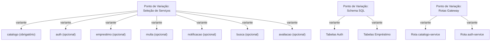
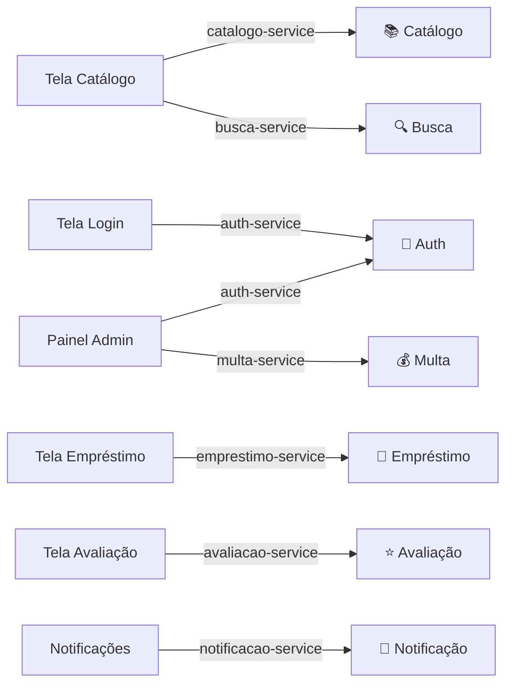
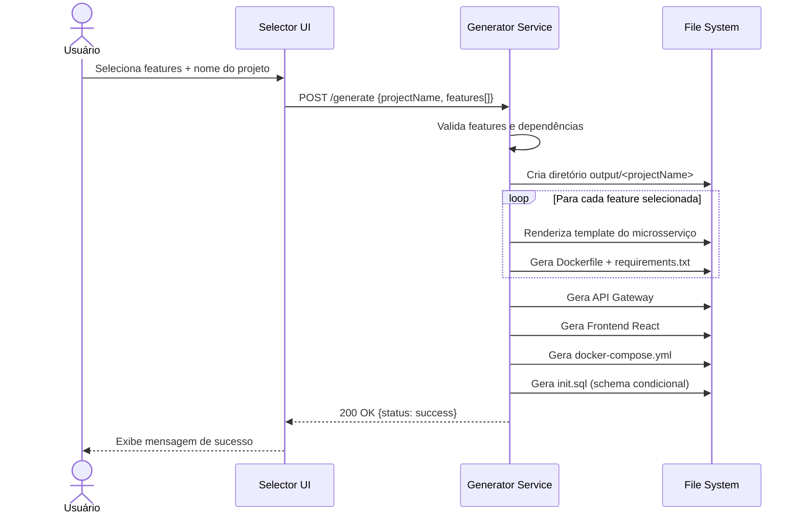
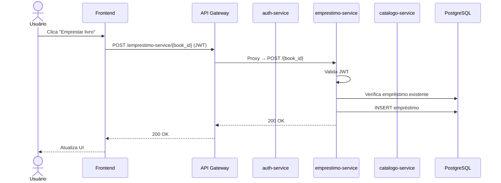
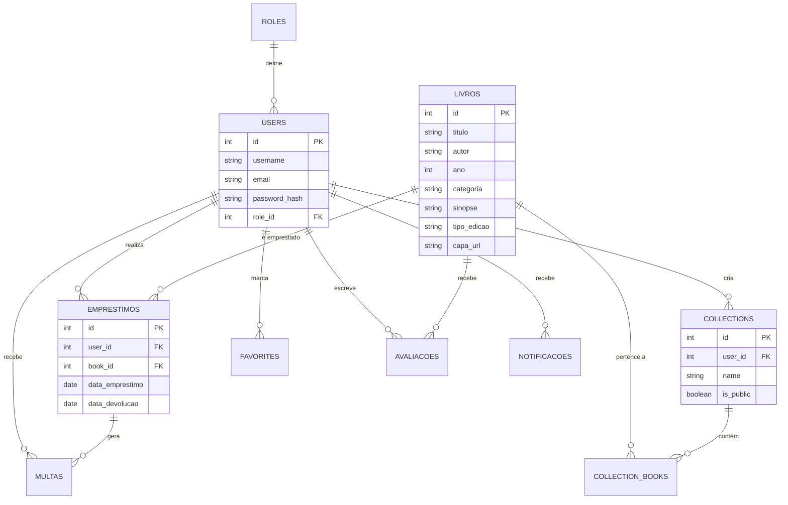

# 📋 Backlog de Tarefas — Relatório LPS Biblioteca

Este documento contém o backlog completo de tarefas para preencher o [RELATORIO.md](./RELATORIO.md). Cada tarefa é autocontida e pode ser executada sequencialmente por um agente de código.

> **Legenda de status:**
> - `[ ]` — Pendente
> - `[/]` — Em andamento
> - `[x]` — Concluída

---

## 📅 Cronograma de Desenvolvimento (Referência)

O desenvolvimento do projeto ocorreu entre **15/05/2026** e **08/06/2026** (~25 dias, 4 sprints).

| Sprint | Período               | Duração  | Foco Principal                                             |
|:------:|:---------------------:|:--------:|------------------------------------------------------------|
| 1      | 15/05 – 22/05/2026    | 8 dias   | Planejamento, modelagem de features e setup da LPS          |
| 2      | 23/05 – 29/05/2026    | 7 dias   | Módulos core + auth + empréstimo + Selector UI              |
| 3      | 30/05 – 04/06/2026    | 6 dias   | Módulos opcionais (multa, notificação, busca, avaliação) + frontend gerado |
| 4      | 05/06 – 08/06/2026    | 4 dias   | Integração end-to-end, testes, documentação e polimento     |

> As datas acima devem ser utilizadas nas seções 2, 4 e 5 do `RELATORIO.md`. O cronograma já foi preenchido nessas seções.

---

## 📌 Sprint 0 — Preparação e Pesquisa

- [x] **T0.1 — Coletar informações do repositório**
  - Ler todos os arquivos em `Docs/`, `generator-service/generator.py`, `selector-ui/src/App.jsx`, `selector-ui/src/features.js`, e `docker-compose.yml`.
  - Objetivo: ter contexto completo do projeto para preencher cada seção.

- [x] **T0.2 — Ler e catalogar os templates de microsserviços**
  - Ler todos os arquivos `*.tmpl` em `generator-service/templates/` para documentar endpoints, modelos de dados e regras de negócio de cada microsserviço.

---

## 📌 Sprint 1 — Seções 1 a 3 (Fundamentação)

- [x] **T1.1 — Preencher Seção 1: Enunciado do Projeto**
  - Substituir o TODO na seção 1 do `RELATORIO.md` por uma descrição formal do enunciado.
  - Incluir: objetivo do projeto, domínio (Biblioteca Online), requisitos funcionais e não funcionais.
  - Fonte: `README.md`, `Docs/PROJECT_DESCRIPTION.md`.

- [x] **T1.2 — Preencher Seção 2: Metodologia Ágil (Scrum)** ✅ _Já preenchida_
  - Descrição do Scrum já inserida no `RELATORIO.md` (papéis, eventos, artefatos).
  - Tabela de Sprints com período (15/05–08/06), objetivo e duração já incluída.
  - Ferramentas de gestão documentadas (GitHub, GitHub Issues).
  - **Revisão:** Verificar se deseja adicionar mais detalhes ou ajustar datas.

- [x] **T1.3 — Preencher Seção 3.1: Linha de Produto de Software**
  - Descrever a abordagem de LPS: Engenharia de Domínio e Engenharia de Aplicação.
  - Explicar como o Generator Service atua como fábrica de produtos.

- [x] **T1.4 — Preencher Seção 3.2: Microsserviços**
  - Descrever a adoção de microsserviços: isolamento, banco por serviço, comunicação via Gateway.

- [x] **T1.5 — Preencher Seção 3.3: Componentes de Software**
  - Descrever os componentes reutilizáveis: templates Jinja2, Dockerfiles genéricos, schema SQL condicional.

---

## 📌 Sprint 2 — Seção 4 (Desenvolvimento)

- [x] **T2.1 — Preencher Seção 4: Desenvolvimento do Projeto** ✅ _Já preenchida_
  - Narrativa por sprint (1–4) já inserida no `RELATORIO.md` com datas reais.
  - Decisões técnicas documentadas para cada sprint.
  - Evolução de stubs para templates completos mencionada (Sprint 3).
  - **Revisão:** Verificar se deseja expandir a narrativa.

---

## 📌 Sprint 3 — Seção 5 (Backlogs, Diagramas e Variabilidade)

### Product/Sprint Backlogs

- [x] **T3.1 — Criar Product Backlog como tabela** ✅ _Já preenchida_
  - Tabela com 15 user stories (PB01–PB15) já inserida no `RELATORIO.md` seção 5.
  - Colunas: ID, User Story, Prioridade, Sprint, Status.
  - **Revisão:** Verificar se deseja adicionar mais itens ao backlog.

- [x] **T3.2 — Criar Sprint Backlogs por Sprint** ✅ _Já preenchida_
  - Sprint Backlogs para as 4 sprints (15/05–08/06) já inseridos no `RELATORIO.md`.
  - Cada sprint com tabela de tarefas e status.
  - **Revisão:** Verificar se deseja ajustar tarefas específicas.

### Diagrama de Features (5.1)

- [x] **T3.3 — Aprimorar Diagrama de Features (Mermaid)**
  - O esqueleto já contém um diagrama Mermaid básico.
  - Aprimorar adicionando:
    - Notação FODA (Feature-Oriented Domain Analysis) ou similar
    - Distinção visual clara entre features obrigatórias, opcionais e alternativas
    - Cardinalidade das relações
  - _Técnica: diagrama Mermaid no próprio Markdown._

- [x] **T3.4 — Gerar imagem estática do Diagrama de Features (alternativa)**
  - Criar um script Python usando `graphviz` ou `matplotlib` para gerar uma imagem PNG do diagrama de features.
  - Salvar em `Docs/img/diagrama_features.png`.
  - Referenciar a imagem no `RELATORIO.md` como alternativa ao Mermaid.
  - _Técnica: Python (`graphviz` ou `matplotlib`)._

```python
# Exemplo de script para gerar diagrama de features
# Salvar como: Docs/scripts/gerar_diagrama_features.py

import graphviz

dot = graphviz.Digraph('Features', format='png')
dot.attr(rankdir='TB', bgcolor='white')

# Nó raiz
dot.node('LPS', 'Biblioteca LPS', shape='box', style='filled', fillcolor='#1e293b', fontcolor='white')

# Features
features = {
    'catalogo': ('Catálogo Service\n[Obrigatório]', '#22c55e'),
    'auth': ('Auth Service\n[Opcional]', '#6366f1'),
    'emprestimo': ('Empréstimo Service\n[Opcional]', '#6366f1'),
    'multa': ('Multa Service\n[Opcional]', '#6366f1'),
    'notificacao': ('Notificação Service\n[Opcional]', '#6366f1'),
    'busca': ('Busca Service\n[Opcional]', '#6366f1'),
    'avaliacao': ('Avaliação Service\n[Opcional]', '#6366f1'),
}

for fid, (label, color) in features.items():
    dot.node(fid, label, shape='box', style='filled', fillcolor=color, fontcolor='white')

# Arestas de dependência
dot.edge('LPS', 'catalogo')
dot.edge('LPS', 'auth')
dot.edge('auth', 'emprestimo', label='depende')
dot.edge('catalogo', 'emprestimo', label='depende')
dot.edge('emprestimo', 'multa', label='depende')
dot.edge('auth', 'notificacao', label='depende')
dot.edge('catalogo', 'busca', label='depende')
dot.edge('auth', 'avaliacao', label='depende')
dot.edge('catalogo', 'avaliacao', label='depende')

dot.render('Docs/img/diagrama_features', cleanup=True)
print('Diagrama gerado: Docs/img/diagrama_features.png')
```

### Arquitetura em Camadas e Variabilidade (5.2)

- [x] **T3.5 — Detalhar Diagrama de Arquitetura em Camadas**
  - Aprimorar o diagrama Mermaid existente com mais detalhes:
    - Separação clara: Apresentação → Lógica → Dados
    - Indicação de protocolos (HTTP/REST, SQL)
    - Indicação de portas
  - _Técnica: diagrama Mermaid._

- [x] **T3.6 — Criar Diagrama de Variabilidade detalhado**
  - Criar diagrama mostrando explicitamente:
    - **Pontos de Variação:** seleção de microsserviços, schema SQL condicional, rotas do gateway
    - **Variantes:** cada microsserviço como variante concreta
    - **Restrições:** dependências obrigatórias (requires) e exclusões mútuas (excludes)
  - _Técnica: diagrama Mermaid ou tabela Markdown._



### Diagrama de Componentes (5.3)

- [x] **T3.7 — Criar Diagrama de Componentes UML com interfaces**
  - Aprimorar o diagrama Mermaid existente para seguir a notação UML de componentes.
  - Mostrar interfaces providas (endpoints REST) e interfaces requeridas (dependências).
  - _Técnica: diagrama Mermaid._

### Tela de Configuração (5.4)

- [x] **T3.8 — Capturar screenshots da Selector UI**
  - Capturar screenshots do Selector UI em funcionamento:
    1. Tela inicial com todas as features
    2. Seleção de features com resolução de dependências
    3. Painel de resumo
    4. Mensagem de sucesso após geração
  - Salvar em `Docs/img/`.
  - Inserir no `RELATORIO.md` na seção 5.4.
  - _Técnica: browser automation ou captura manual._

- [x] **T3.9 — Descrever passo a passo da construção de produto**
  - Redigir texto descritivo na seção 5.4 explicando o fluxo de configuração e geração.

---

## 📌 Sprint 4 — Seção 6 (Arquitetura de Microsserviços)

### Arquitetura (6.1)

- [x] **T4.1 — Detalhar Diagrama de Arquitetura de Microsserviços**
  - O esqueleto já tem um diagrama Mermaid. Aprimorar com:
    - Indicação do protocolo de comunicação (HTTP REST)
    - Service discovery (nomes Docker internos)
    - Tratamento de erros (503, 404)
    - Timeouts
  - _Técnica: diagrama Mermaid._

- [x] **T4.2 — Descrever microsserviço de Recomendação**
  - Conforme requisito: o sistema deve fazer recomendação considerando perfil do usuário.
  - Descrever como o serviço de recomendação funciona (pode ser extensão do busca-service ou novo microsserviço).
  - Criar diagrama mostrando o fluxo de dados para recomendação.
  - _Técnica: Mermaid + texto descritivo._

### API Gateway (6.2)

- [x] **T4.3 — Documentar código do API Gateway**
  - Ler o template `generator-service/templates/api-gateway/main.py.tmpl`.
  - Inserir o código completo e documentado na seção 6.2 do relatório.
  - Adicionar comentários explicativos em cada bloco.
  - _Técnica: bloco de código Python no Markdown._

### Especificação dos Microsserviços (6.3)

- [x] **T4.4 — Documentar catalogo-service**
  - Ler `generator-service/templates/catalogo-service/main.py.tmpl`.
  - Inserir código documentado na seção 6.3.1.
  - Explicar modelo de dados, endpoints e regras de negócio.

- [x] **T4.5 — Documentar auth-service**
  - Ler `generator-service/templates/auth-service/main.py.tmpl`.
  - Inserir código documentado na seção 6.3.2.
  - Explicar autenticação JWT, roles, coleções e favoritos.

- [x] **T4.6 — Documentar emprestimo-service**
  - Ler `generator-service/templates/emprestimo-service/main.py.tmpl`.
  - Inserir código documentado na seção 6.3.3.
  - Explicar check-in/check-out, limites e auditoria.

- [x] **T4.7 — Documentar multa-service**
  - Ler `generator-service/templates/multa-service/main.py.tmpl`.
  - Inserir código documentado na seção 6.3.4.
  - Explicar atribuição de multas, quitação e resumo contábil.

- [x] **T4.8 — Documentar notificacao-service**
  - Ler `generator-service/templates/notificacao-service/main.py.tmpl`.
  - Inserir código documentado na seção 6.3.5.
  - Explicar alertas, broadcast e gestão de caixa de entrada.

- [x] **T4.9 — Documentar busca-service**
  - Ler `generator-service/templates/busca-service/main.py.tmpl`.
  - Inserir código documentado na seção 6.3.6.
  - Explicar filtros avançados, estatísticas e destaques.

- [x] **T4.10 — Documentar avaliacao-service**
  - Ler `generator-service/templates/avaliacao-service/main.py.tmpl`.
  - Inserir código documentado na seção 6.3.7.
  - Explicar reviews, UPSERT e ranking top 10.

### Execução dos Microsserviços (6.4)

- [x] **T4.11 — Gerar produto e capturar saída do docker compose ps**
  - Executar o fluxo completo: selecionar todas as features, gerar produto, subir com Docker Compose.
  - Capturar a saída de `docker compose ps` mostrando todos os containers e portas.
  - Inserir na seção 6.4 do relatório.
  - Capturar screenshot da saída do terminal.
  - Salvar em `Docs/img/docker_compose_ps.png`.
  - _Técnica: execução de comando + captura de tela._

### Construção de Aplicações (6.5)

- [x] **T4.12 — Detalhar o passo a passo de construção de produto**
  - Expandir a seção 6.5 com:
    - Pré-requisitos (ferramentas instaladas)
    - Fluxo completo com comandos
    - Variações possíveis (diferentes combinações de features)
    - Verificação de que o produto funciona
  - Incluir exemplo de 2 produtos diferentes (configurações mínima e máxima).

---

## 📌 Sprint 5 — Seção 7 e 8 (Implementação e Funcionamento)

### Tecnologias (7)

- [x] **T5.1 — Revisar e completar tabelas de tecnologias**
  - Verificar se todas as dependências estão listadas (ler `requirements.txt` e `package.json`).
  - Adicionar versões exatas de cada tecnologia.

### Funcionamento do Produto (8)

- [x] **T5.2 — Capturar screenshots do produto gerado em funcionamento**
  - Para cada tela do produto gerado, capturar screenshot e salvar em `Docs/img/`:
    - `tela_login.png` — Tela de login/registro
    - `tela_catalogo.png` — Catálogo de livros
    - `tela_emprestimo.png` — Empréstimos
    - `tela_avaliacao.png` — Avaliações
    - `tela_admin.png` — Painel administrativo
    - `tela_notificacao.png` — Notificações
  - _Técnica: browser automation ou captura manual._

- [x] **T5.3 — Criar mapa de telas com microsserviços anotados**
  - Criar um diagrama mostrando cada tela e quais microsserviços são acionados.
  - _Técnica: diagrama Mermaid._



- [x] **T5.4 — Redigir descrições de cada tela**
  - Para cada seção 8.x, escrever texto explicativo:
    - O que o usuário vê
    - O que acontece ao interagir
    - Quais microsserviços são acionados e quais endpoints são chamados

---

## 📌 Sprint 6 — Seções 9 e 10 (GitHub e Referências)

- [x] **T6.1 — Verificar link do GitHub e instruções de execução**
  - Confirmar que o link do repositório está correto na seção 9.
  - Verificar que o README.md na raiz tem instruções claras de execução.
  - Testar o fluxo completo (clone → install → run) em ambiente limpo.

- [x] **T6.2 — Expandir referências bibliográficas**
  - Adicionar referências adicionais relevantes:
    - Documentação oficial do FastAPI, Flask, React, Docker
    - Artigos sobre LPS, microsserviços e reuso de software
    - Materiais da disciplina
  - Formatar segundo norma ABNT ou padrão da disciplina.

---

## 📌 Sprint 7 — Diagramas e Gráficos Complementares

- [x] **T7.1 — Criar gráfico de distribuição de endpoints por microsserviço**
  - Script Python usando `matplotlib` para gerar gráfico de barras.
  - Dados: contar endpoints por microsserviço a partir dos templates.
  - Salvar em `Docs/img/endpoints_por_servico.png`.
  - _Técnica: Python (`matplotlib`)._

```python
# Exemplo: Docs/scripts/gerar_grafico_endpoints.py
import matplotlib.pyplot as plt

servicos = [
    'Catálogo', 'Auth', 'Empréstimo',
    'Multa', 'Notificação', 'Busca', 'Avaliação', 'Gateway'
]
endpoints = [4, 9, 5, 4, 5, 3, 4, 2]  # TODO: atualizar com contagem real

fig, ax = plt.subplots(figsize=(10, 5))
colors = ['#22c55e', '#6366f1', '#8b5cf6', '#f59e0b', '#ef4444', '#06b6d4', '#ec4899', '#64748b']
bars = ax.barh(servicos, endpoints, color=colors)
ax.set_xlabel('Número de Endpoints')
ax.set_title('Distribuição de Endpoints por Microsserviço')
ax.bar_label(bars, padding=3)
plt.tight_layout()
plt.savefig('Docs/img/endpoints_por_servico.png', dpi=150)
print('Gráfico gerado: Docs/img/endpoints_por_servico.png')
```

- [x] **T7.2 — Criar diagrama de dependências entre microsserviços**
  - Script Python usando `graphviz` para gerar grafo de dependências.
  - Salvar em `Docs/img/dependencias_servicos.png`.
  - _Técnica: Python (`graphviz`)._

- [x] **T7.3 — Criar diagrama de sequência para fluxo de geração**
  - Diagrama Mermaid mostrando o fluxo temporal da geração de produto.
  - _Técnica: diagrama Mermaid (sequenceDiagram)._



- [x] **T7.4 — Criar diagrama de sequência para fluxo de empréstimo**
  - Diagrama Mermaid mostrando a interação entre microsserviços no fluxo de empréstimo.
  - _Técnica: diagrama Mermaid (sequenceDiagram)._



- [x] **T7.5 — Criar tabela comparativa de configurações de produto**
  - Tabela Markdown mostrando 3 configurações possíveis de produto:
    - **Mínima:** apenas catalogo-service
    - **Padrão:** catalogo + auth + empréstimo + busca
    - **Completa:** todos os serviços
  - Indicar containers gerados, portas e tabelas SQL para cada configuração.
  - _Técnica: tabela Markdown._

- [x] **T7.6 — Criar diagrama ER (Entidade-Relacionamento) do banco de dados**
  - Diagrama Mermaid mostrando as tabelas do PostgreSQL e seus relacionamentos.
  - _Técnica: diagrama Mermaid (erDiagram)._



---

## 📌 Sprint 8 — Revisão Final e Polimento

- [x] **T8.1 — Remover todos os comentários TODO do RELATORIO.md**
  - Fazer uma varredura final e garantir que nenhum `<!-- TODO: ... -->` permanece.

- [x] **T8.2 — Validar renderização dos diagramas Mermaid**
  - Verificar que todos os diagramas Mermaid renderizam corretamente no GitHub.
  - Corrigir sintaxe se necessário.

- [x] **T8.3 — Verificar links internos e referências de imagens**
  - Garantir que todos os links (``, `[link]()`) funcionam.
  - Verificar que todas as imagens referenciadas existem em `Docs/img/`.

- [x] **T8.4 — Revisão ortográfica e de formatação**
  - Revisar o relatório completo para erros de português, formatação e consistência.

- [x] **T8.5 — Gerar versão PDF do relatório (opcional)**
  - Usar `pandoc` ou ferramenta similar para converter o Markdown em PDF.
  - Comando sugerido:
    ```powershell
    pandoc Docs/RELATORIO.md -o Docs/RELATORIO.pdf --pdf-engine=xelatex
    ```

---

## 📊 Resumo de Tarefas

| Sprint | Seção do Relatório | Qtd. Tarefas | ✅ Concluídas | Tipo principal                |
|:------:|:------------------:|:------------:|:-------------:|-------------------------------|
| 0      | Preparação         | 2            | 2             | Pesquisa/Leitura              |
| 1      | 1, 2, 3            | 5            | 5             | Redação                       |
| 2      | 4                  | 1            | 1             | Redação                       |
| 3      | 5                  | 9            | 9             | Diagramas + Redação           |
| 4      | 6                  | 12           | 12            | Código + Diagramas + Redação  |
| 5      | 7, 8               | 4            | 4             | Screenshots + Redação         |
| 6      | 9, 10              | 2            | 2             | Verificação + Referências     |
| 7      | Complementar       | 6            | 6             | Gráficos Python + Diagramas   |
| 8      | Revisão            | 5            | 5             | QA + Polimento                |
| **Total** |                 | **46**       | **46**        |                               |

> **Progresso atual:** 46/46 tarefas concluídas (100%). As seções 2, 4 e 5 (cronograma, desenvolvimento e backlogs) já estão preenchidas com o cronograma de desenvolvimento de **15/05/2026 a 08/06/2026**.

---

## 🛠️ Ferramentas Necessárias

| Ferramenta     | Uso                                        | Instalação                                   |
|----------------|--------------------------------------------|----------------------------------------------|
| Python 3.11+   | Scripts de geração de gráficos             | Já instalado                                 |
| `matplotlib`   | Gráficos de barras, distribuição           | `pip install matplotlib`                     |
| `graphviz`     | Diagramas de dependência (alternativa)     | `pip install graphviz` + instalar binário    |
| Mermaid        | Diagramas inline no Markdown               | Suporte nativo do GitHub                     |
| `pandoc`       | Conversão para PDF (opcional)              | `choco install pandoc` ou download manual    |
| Docker         | Execução do produto para screenshots       | Já instalado                                 |
